# 🌍 Go Naturally — AI-Powered Eco-Learning Platform

> **Turn the World Around You Into a Game**
> An **AI + Map-based gamified environmental platform** that empowers **students, teachers, and NGOs** to collaborate on sustainability efforts, report environmental issues, and participate in eco-missions.

---

---

## 🚀 Vision

Go Naturally transforms environmental action into an **interactive learning adventure**. By blending **AI, gamification, and geolocation**, we make eco-awareness engaging for youth, schools, and NGOs while creating measurable real-world impact.

* **Identify plants instantly** with AI.
* **Recognize animals** and learn their traits.
* **Report litter spots** with before/after cleanup.
* **Join eco-events** hosted by NGOs and schools.
* **Earn EcoPoints & climb leaderboards** to stay motivated.

This is not just an app — it's a **movement** that gamifies eco-responsibility.

---

## 🎯 Problems We Address

* Low student involvement in real-world cleanups
* Scattered NGO/school platforms, no single hub
* Untracked eco-impact (tree planting, litter collection, biodiversity)
* Lack of engaging, gamified approaches to sustainability

---

## 🌟 Our Solution & Uniqueness

* **Gamified Maps** — Pokémon Go–style eco-missions
* **AI Nature Insights** — instant plant & animal recognition
* **Event Hub** — one-stop space for eco-drives & events
* **EcoPoints & Leaderboards** — rewards + competition to sustain engagement

---

## 🛠️ Tech Stack

**Frontend:** ReactJS (Vite + TypeScript + TailwindCSS), Mapbox, ReadyPlayerMe  
**Backend:** Node.js (Fastify, TypeScript, Prisma), PostgreSQL (Supabase), JWT Auth  
**APIs & AI:** Google Gemini AI, PlantNet API, OpenWeatherMap, MapBox  
**Hosting:** Render & Azure

---

## 🔄 System Architecture & Data Flow

```mermaid
---
config:
  layout: dagre
---
flowchart TD
    User["👥 User<br>(Student/NGO/Teacher)"] L_User_Frontend_0@-- <b>🔑 LOGIN/REGISTER</b> --> Frontend["⚛️ Frontend<br>(React + Vite + Tailwind)"]
    Frontend L_Frontend_Backend_0@-- <b>📡 REST API CALLS</b> --> Backend["🖥️ Backend<br>(Fastify + Node.js)"]
    Backend L_Backend_Auth_0@-- <b>✅ AUTH VERIFICATION</b> --> Auth["🔐 Supabase Auth"]
    Backend L_Backend_Database_0@-- <b>💾 DB OPERATIONS</b> --> Database["🗄️ PostgreSQL Database"]
    Backend L_Backend_Storage_0@-- <b>📁 FILE UPLOADS</b> --> Storage["☁️ S3 Storage"]
    Backend L_Backend_AI_0@-- <b>🧠 AI INFERENCE</b> --> AI["🤖 Google Gemini AI /<br>🌿 PlantNet"]
    Backend L_Backend_Maps_0@-- <b>🌍 WEATHER &amp; MAPS</b> --> Maps["🗺️ OpenWeatherMap /<br>🌤️ MapBox"]
    AI L_AI_Backend_0@-- <b>🔄 RESULTS</b> --> Backend
    Database L_Database_Backend_0@-- <b>📊 DATA</b> --> Backend
    Storage L_Storage_Backend_0@-- <b>📤 FILES</b> --> Backend
    Maps L_Maps_Backend_0@-- <b>📍 LOCATION DATA</b> --> Backend
    Backend L_Backend_Frontend_0@-- <b>📨 RESPONSES</b> --> Frontend
    Frontend L_Frontend_User_0@-- <b>✨ INTERACTIVE UI</b> --> User
     User:::user
     Frontend:::frontend
     Backend:::backend
     Auth:::auth
     Database:::db
     Storage:::storage
     AI:::ai
     Maps:::maps
    classDef user fill:#b3e6b5,stroke:#1d7d1d,stroke-width:3px,color:#000000
    classDef frontend fill:#cbeafe,stroke:#2563eb,stroke-width:3px,color:#000000
    classDef backend fill:#f9d9c6,stroke:#c2410c,stroke-width:3px,color:#000000
    classDef auth fill:#fff9c4,stroke:#b59f01,stroke-width:3px,color:#000000
    classDef db fill:#e0e7ff,stroke:#312e81,stroke-width:3px,color:#000000
    classDef storage fill:#ffe0e3,stroke:#be185d,stroke-width:3px,color:#000000
    classDef ai fill:#e0f7fa,stroke:#006064,stroke-width:3px,color:#000000
    classDef maps fill:#f0fff4,stroke:#059669,stroke-width:3px,color:#000000
  %% (linkStyle removed so connections use default styling)
    L_User_Frontend_0@{ animation: fast } 
    L_Frontend_Backend_0@{ animation: fast } 
    L_Backend_Auth_0@{ animation: fast } 
    L_Backend_Database_0@{ animation: fast } 
    L_Backend_Storage_0@{ animation: fast } 
    L_Backend_AI_0@{ animation: fast } 
    L_Backend_Maps_0@{ animation: fast } 
    L_AI_Backend_0@{ animation: fast } 
    L_Database_Backend_0@{ animation: fast } 
    L_Storage_Backend_0@{ animation: fast } 
    L_Maps_Backend_0@{ animation: fast } 
    L_Backend_Frontend_0@{ animation: fast } 
    L_Frontend_User_0@{ animation: fast }

```

### Architecture Overview

Our system follows a modern **microservices-inspired architecture** with clear separation of concerns:

- **👥 User Layer**: Students, NGOs, and Teachers interact through an intuitive interface
- **⚛️ Frontend**: React-based SPA with real-time updates and responsive design
- **🖥️ Backend**: RESTful API built with Fastify for high performance
- **🌐 External Services**: Integrated third-party services for enhanced functionality
- **🗄️ Data Layer**: PostgreSQL for reliable data persistence

The architecture ensures **scalability**, **maintainability**, and **security** while providing seamless user experiences across all platforms. The animated flowchart above demonstrates the real-time data flow between all system components.

---

## 📱 Core Features

### 🔐 Authentication

* JWT-based login via Supabase
* Secure role-based access (Students / Teachers / NGOs)

### 🌱 Plants & Animals

* Upload images → AI-powered recognition & rarity classification
* Students earn EcoPoints for biodiversity reporting

### 🗑 Litter Management

* Upload before/after cleanup photos
* NGOs/schools can track eco-drives and student participation

### 🏆 Leaderboards & EcoPoints

* Gamified eco-scoring system
* Compete individually or as an organization

### 🎉 Event Hub

* NGOs and schools can create eco-events
* Students can apply & track participation

---

## 📊 Impact

* **Economic:** Reduces municipal cleanup costs, supports eco-tourism, incentivizes NGOs & schools
* **Social:** Builds eco-awareness in youth, strengthens NGO-school collaboration, promotes community action
* **Environmental:** Tracks measurable eco-impact (more trees planted, less litter, biodiversity monitoring)

---

## ⚡ Challenges & Our Strategies

| Challenge               | Strategy                                     |
| ----------------------- | -------------------------------------------- |
| Low Student Engagement  | Gamified missions + EcoPoints                |
| Fake/Incorrect Reports  | AI Moderation + Verification                 |
| NGO/School Trust Issues | Partnerships + Teacher Involvement           |
| Maintenance & Updates   | Seasonal eco-tasks + regular content refresh |

---

## 🧭 Roadmap

* MVP with plant/animal ID, trash reporting, eco-events
* Advanced gamification (quests, streaks, eco-badges)
* Multilingual support for broader adoption
* Mobile-first deployment (React Native)

---

## 🏆 Why Go Naturally Matters

> **We turn eco-learning into eco-action.**
> By blending **AI, gamification, and community**, Go Naturally makes sustainability engaging, measurable, and impactful at scale.
> We believe in **empowering the next generation** to take ownership of their environment—one EcoPoint at a time.

---

**Built with love by Team Hail Hydra | Smart India Hackathon 2025**
